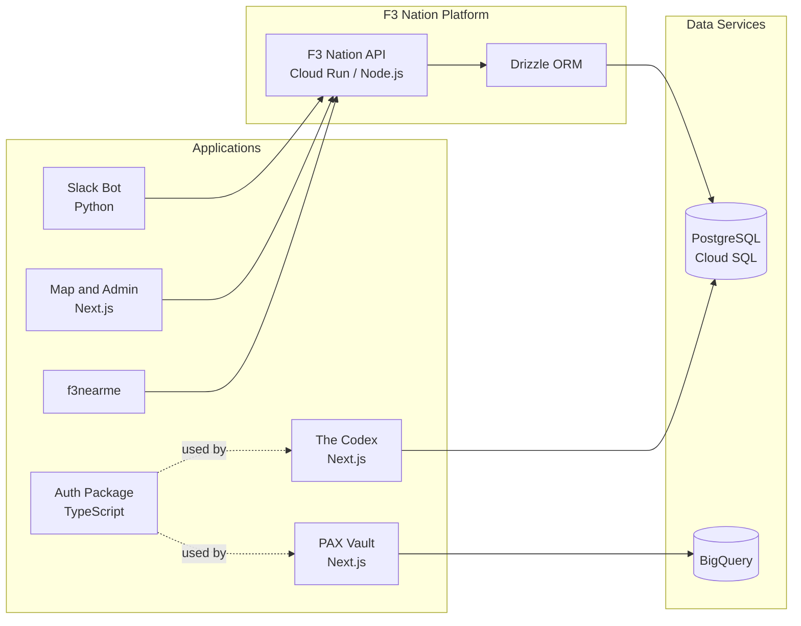

# F3 Nation — Developer Onboarding

> This is the `.github` repository for the **F3-Nation** organization. The [`profile/README.md`](profile/README.md) is displayed on our [GitHub org homepage](https://github.com/F3-Nation) and serves as the front door for new contributors. This README contains additional detail for developers getting set up.

---

## Getting Started

1. **Read the [org homepage](https://github.com/F3-Nation)** to understand the landscape — what we build, who uses it, and how it all fits together.
2. **Pick a repo** that interests you (see the [Repository Guide](profile/README.md#repository-guide)).
3. **Clone it and follow the repo's README** for local setup instructions.
4. **Find an issue** to work on, or open one if you spot something that could be better.
5. **Open a pull request** — we review everything and are happy to help.

### Prerequisites You'll Encounter

Most of our repos use one or both of these:

| Stack | You'll Need |
|-------|------------|
| **TypeScript apps** (monorepo, map, PAX Vault, Codex, etc.) | Node.js 18+, PNPM |
| **Python apps** (Slack bot) | Python 3.11+, Poetry, Docker |

For database access during development, check the repo-specific README — some repos use local Docker Postgres, others connect to shared dev instances.

---

## Architecture Overview

Almost everything runs on **Google Cloud Platform**:

- **Cloud Run** — hosts our APIs and web apps as containerized services
- **Cloud SQL (PostgreSQL)** — our primary relational database, shared across most apps
- **BigQuery** — analytics data warehouse, used by PAX Vault
- **Firebase** — authentication for some apps (PAX Vault, Codex)
- **GitHub Pages** — hosts the status page and org map

### How the Pieces Connect

For the broader org-level view, see the [homepage architecture section](profile/README.md#the-big-picture).

---

## Data Model

To avoid duplicate maintenance, we keep the canonical data model diagram on the org homepage README: [Data Model Overview](profile/README.md#data-model-overview).

### Key Concepts

| Database Term | F3 Term | Meaning |
|------|------|---------|
| user | **PAX** | A participant — anyone who shows up to a workout |
| org | **AO** | Area of Operations — an organizational unit, NOT a physical location |
| org | **Region** | A geographic grouping of AOs under shared leadership |
| user | **Q** | The person leading a particular workout |
| entry | **Exicon** | The F3 exercise dictionary |
| entry | **Lexicon** | F3-specific terminology and definitions |

---

## Repo Quick Links

| Repo | Runs On |
|------|---------|
| [f3-nation](https://github.com/F3-Nation/f3-nation) | Cloud Run |
| [f3-nation-slack-bot](https://github.com/F3-Nation/f3-nation-slack-bot) | Cloud Run |
| [pax-vault](https://github.com/F3-Nation/pax-vault) | Cloud Run |
| [f3nearme](https://github.com/F3-Nation/f3nearme) | Cloud Run |
| [f3-nation-auth](https://github.com/F3-Nation/f3-nation-auth) | npm package |
| [the-codex](https://github.com/F3-Nation/the-codex) | Cloud Run |
| [f3-region-pages](https://github.com/F3-Nation/f3-region-pages) | Cloud Run |
| [f3-status](https://github.com/F3-Nation/f3-status) | GitHub Pages |
| [f3-org-map](https://github.com/F3-Nation/f3-org-map) | GitHub Pages |

---

## Use of AI

We're all doing it. And we're working on some guidelines for using it.

---

## Contributing

We're all volunteers here. A few norms:

- **Ask questions.** No question is too basic. Open an issue or comment on a PR.
- **Small PRs are better.** They're easier to review and merge.
- **Write a good PR description.** Say what you changed and why.
- **Don't worry about breaking things.** That's what code review and CI are for.
- **Be kind.** We're all here to accelerate and have fun doing it.
