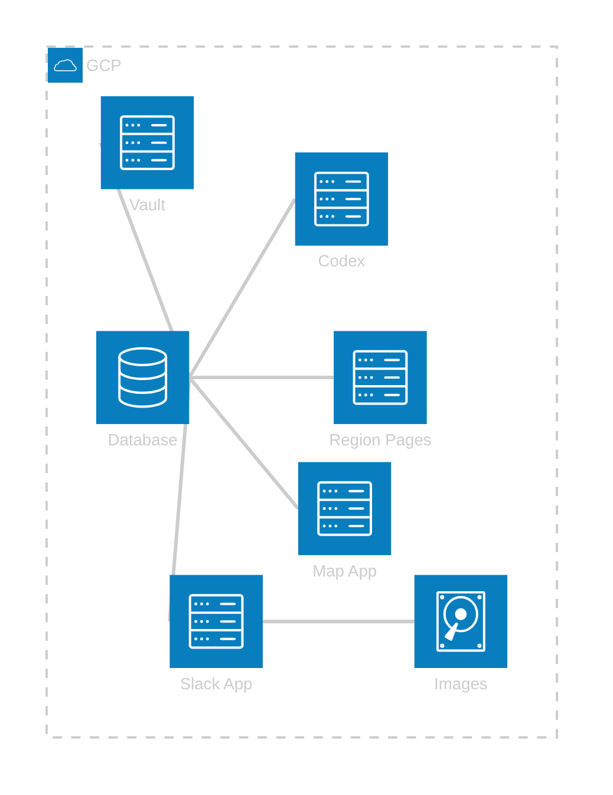
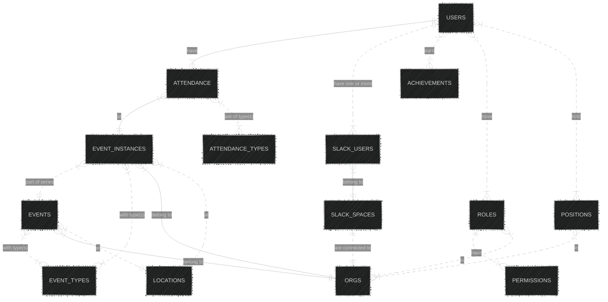

# Architecture Overview

```mermaid
---
config:
  theme: neo-dark
---
architecture-beta

    group gcp(cloud)[GCP]
    service db(database)[Database] in gcp
    service slack_app(server)[Slack App] in gcp
    service slack_storage(disk)[Images] in gcp
    service map_app(server)[Map App] in gcp
    service codex_app(server)[Codex] in gcp
    service dashboard_app(server)[Vault] in gcp
    service region_pages(server)[Region Pages] in gcp
    db:R -- L:slack_app
    db:R -- L:map_app
    db:R -- L:codex_app
    db:R -- L:dashboard_app
    db:R -- L:region_pages
    slack_app:R -- L:slack_storage
```

# Data - Entity Overview

```mermaid
---
config:
    look: handDrawn
    theme: dark
---

erDiagram
    USERS ||--|{ ATTENDANCE : have
    ATTENDANCE }|--|| EVENT_INSTANCES: at
    ATTENDANCE }|..|{ ATTENDANCE_TYPES : "are of type(s)"
    EVENT_INSTANCES }|..|| EVENTS : "part of series"
    EVENT_INSTANCES }|..|{ EVENT_TYPES : "with type(s)"
    EVENTS }|..|{ EVENT_TYPES : "with type(s)"
    EVENT_INSTANCES }|--|| ORGS : "belong to"
    EVENT_INSTANCES }|..|| LOCATIONS : "at"
    EVENTS }|--|| ORGS : "belong to"
    EVENTS }|..|| LOCATIONS : "at"
    SLACK_SPACES ||..|| ORGS : "are connected to"
    USERS ||..|{ SLACK_USERS : "have one or more"
    SLACK_USERS }|--|| SLACK_SPACES : "belong to"
    USERS }|..|{ ACHIEVEMENTS : "earn"
    USERS }|..|{ ROLES : "have"
    ROLES ||..|{ PERMISSIONS : "have"
    ROLES }|..|{ ORGS : "in"
    USERS }|..|{ POSITIONS : "hold"
    POSITIONS }|..|{ ORGS : "in"
```
