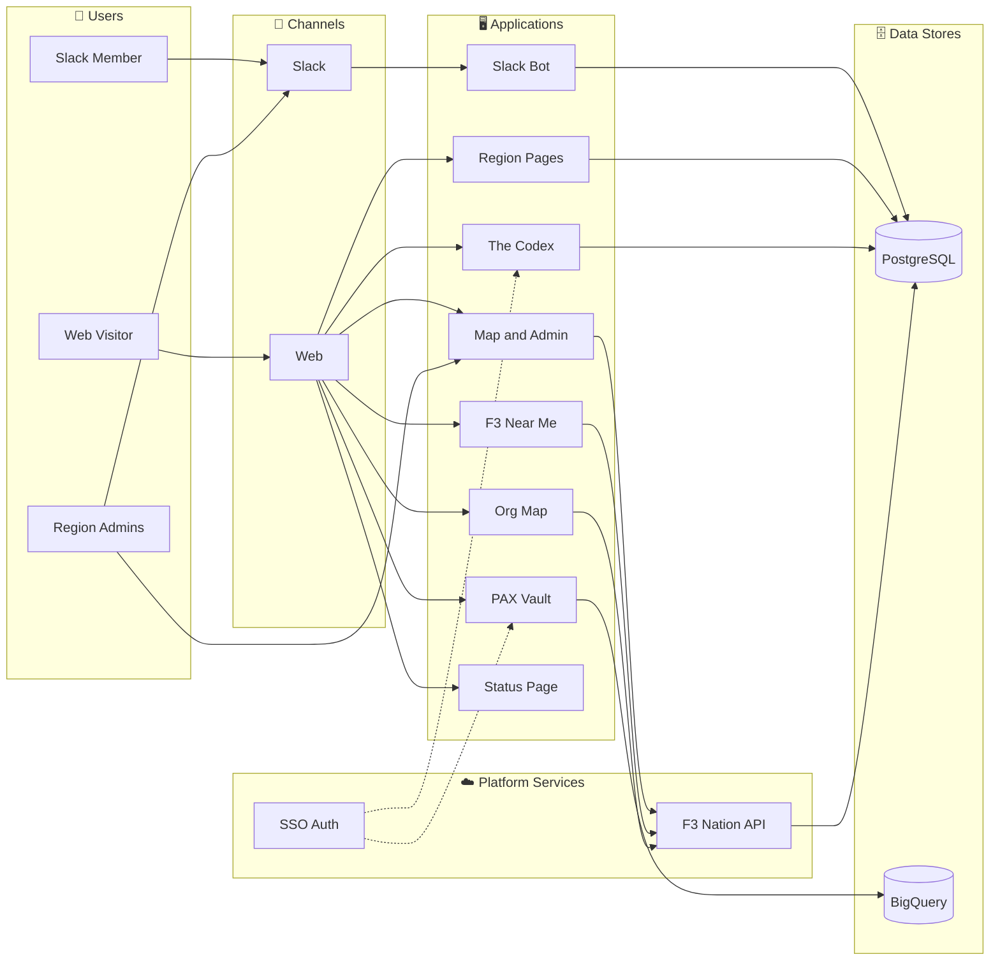
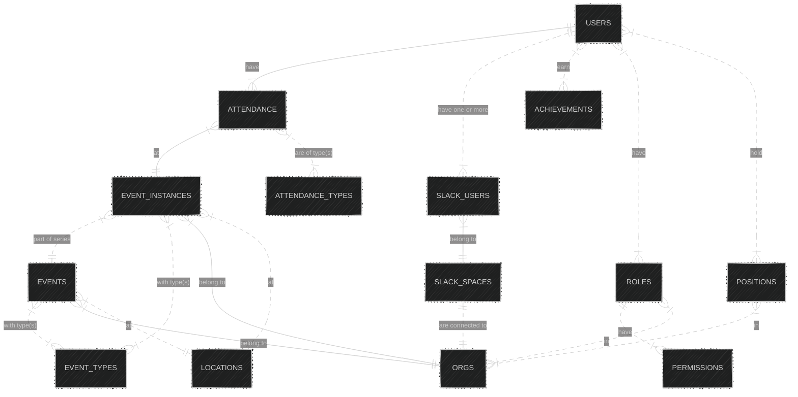

# Welcome to F3 Nation Tech 🏋️

We're a volunteer group of amateur developers building the digital platform behind **[F3 Nation](https://f3nation.com)** — a national network of free, peer-led outdoor workout groups for men. Our tools help regions organize workouts, track attendance, and grow their communities.

**Everyone is welcome.** Whether you're a seasoned engineer or writing your first pull request, there's a place for you here.

---

## The Big Picture

---

## Repository Guide

| Repo | What It Does | Tech |
|------|-------------|------|
| **[f3-nation](https://github.com/F3-Nation/f3-nation)** | Monorepo — API, interactive map, and admin tooling | TypeScript · Next.js · Drizzle ORM · Turbo |
| **[f3-nation-slack-bot](https://github.com/F3-Nation/f3-nation-slack-bot)** | The primary way most people interact with F3 tech — scheduling, attendance, region management. Installed on 300+ Slack workspaces | Python · Slack Bolt · SQLAlchemy |
| **[pax-vault](https://github.com/F3-Nation/pax-vault)** | Read-only analytics dashboard — participation, leadership, and engagement insights | TypeScript · Next.js · BigQuery · Firebase Auth |
| **[f3nearme](https://github.com/F3-Nation/f3nearme)** | Lightweight "find a workout near you" map ([f3near.me](https://f3near.me)) | TypeScript |
| **[f3-nation-auth](https://github.com/F3-Nation/f3-nation-auth)** | Shared SSO authentication package used by PAX Vault and The Codex | TypeScript |
| **[the-codex](https://github.com/F3-Nation/the-codex)** | The F3 Exicon (exercises) and Lexicon (terminology) — a community knowledge base | TypeScript · Next.js · NextAuth |
| **[f3-region-pages](https://github.com/F3-Nation/f3-region-pages)** | Out-of-the-box website landing pages for regions that don't want to self-host | TypeScript · Next.js · Drizzle ORM |
| **[f3-status](https://github.com/F3-Nation/f3-status)** | Simple health/status page for all F3 apps ([status.f3nation.com](https://status.f3nation.com)) | TypeScript · Vite · GitHub Pages |
| **[f3-org-map](https://github.com/F3-Nation/f3-org-map)** | Geographic digital directory — visualizes F3's org structure on a map | TypeScript · Vite · Leaflet |

---

## Environment URLs

This table makes it easy for contributors to find production and staging environments in one place.

| Repo | Production | Staging | Hosting |
|------|------------|---------|-------|
| **[f3-nation](https://github.com/F3-Nation/f3-nation)** | [api.f3nation.com](https://api.f3nation.com) [map.f3nation.com](https://map.f3nation.com) [map.f3nation.com/admin](https://map.f3nation.com/admin) | [staging.api.f3nation.com](https://staging.api.f3nation.com) [staging.map.f3nation.com](https://staging.map.f3nation.com) [staging.map.f3nation.com/admin](https://staging.map.f3nation.com/admin) | GCP Cloud Run |
| **[f3nearme](https://github.com/F3-Nation/f3nearme)** | [f3near.me](https://f3near.me) | - | Firebase and Firestore |
| **[pax-vault](https://github.com/F3-Nation/pax-vault)** | [pax-vault.f3nation.com](https://pax-vault.f3nation.com) | [staging.pax-vault.f3nation.com](https://staging.pax-vault.f3nation.com) | Firebase and GCP Big Query |
| **[the-codex](https://github.com/F3-Nation/the-codex)** | [codex.f3nation.com](https://codex.f3nation.com) | - | Firebase |
| **[f3-org-map](https://github.com/F3-Nation/f3-org-map)** | [org.f3nation.com](https://org.f3nation.com) | - | GitHub Pages |
| **[f3-region-pages](https://github.com/F3-Nation/f3-region-pages)** | [regions.f3nation.com](https://regions.f3nation.com) | - | Firebase |
| **[f3-status](https://github.com/F3-Nation/f3-status)** | [status.f3nation.com](https://status.f3nation.com) | - | GitHub Pages |
| **[f3-nation-slack-bot](https://github.com/F3-Nation/f3-nation-slack-bot)** | [slackbot.f3nation.com](https://slackbot.f3nation.com) | [Cloud Run](https://f3-nation-slack-bot-419868269651.us-central1.run.app) | GCP Cloud Run |

---

## Tech Stack at a Glance

| Layer | Technologies |
|-------|-------------|
| **Frontend** | TypeScript · Next.js · React · Vite · Tailwind CSS · Leaflet |
| **Backend** | Python (Slack Bolt) · Node.js · Next.js API Routes |
| **Database** | PostgreSQL (Cloud SQL) · Google BigQuery |
| **Auth** | NextAuth · Firebase · Custom SSO |
| **Infrastructure** | Google Cloud Run · Cloud SQL · Firebase · GitHub Pages |
| **Dev Tools** | PNPM · Turbo · Poetry · Docker |

---

## Where Can I Help?

Not sure where to start? Here are some common entry points:

- 🐛 **Fix a bug** — Browse [open issues](https://github.com/orgs/F3-Nation/repositories) across our repos. Look for issues labeled `good first issue`.
- 🗺️ **Frontend / Maps** — [f3-nation](https://github.com/F3-Nation/f3-nation) (Next.js monorepo), [f3nearme](https://github.com/F3-Nation/f3nearme), or [f3-org-map](https://github.com/F3-Nation/f3-org-map) (Leaflet)
- 🤖 **Slack Bot / Python** — [f3-nation-slack-bot](https://github.com/F3-Nation/f3-nation-slack-bot) — the most-used piece of our stack
- 📊 **Data & Analytics** — [pax-vault](https://github.com/F3-Nation/pax-vault) — BigQuery-powered dashboards
- 🔐 **Auth / SSO** — [f3-nation-auth](https://github.com/F3-Nation/f3-nation-auth)
- 📖 **Content / Knowledge** — [the-codex](https://github.com/F3-Nation/the-codex) — exercises and terminology
- 🏠 **Region Websites** — [f3-region-pages](https://github.com/F3-Nation/f3-region-pages)

Each repo has its own README with setup instructions. Jump in, ask questions, and don't worry about breaking things — that's what pull requests are for. For org-wide contributor guidance, see the [root .github README](../README.md).

---

## Data Model Overview

Our core data model centers around **users** attending **events** at **organizations** (regions, AOs), connected via **Slack workspaces**:

